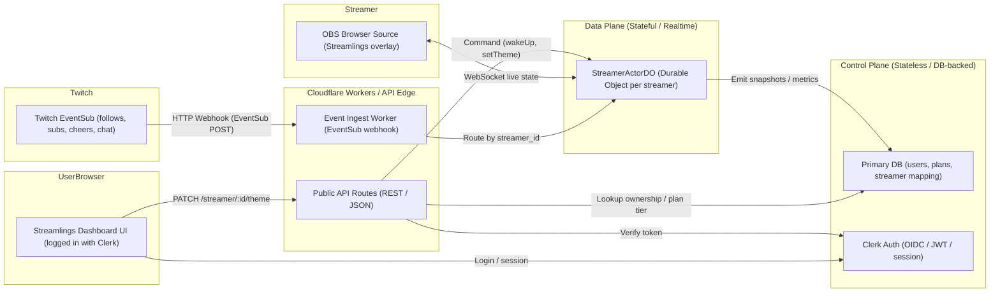

# streamlings
A little pet that lives on your stream and responds to chat. It's like a Tamagotchi powered by your audience.

## Architecture

Streamlings uses a multi-worker architecture with platform adapters:

- **apps/twitch-eventsub** - Twitch EventSub adapter (port 8788)
  - Receives Twitch webhooks
  - Maps Twitch user IDs → internal user IDs
  - Forwards to StreamlingState worker

- **apps/streamling-state** - Core state management (port 8787)
  - Platform-agnostic Durable Object storage
  - Tracks event counts and streamling state
  - Can receive events from multiple platform adapters

- **apps/web** - SvelteKit web dashboard
  - User-facing management interface

This design allows supporting multiple streaming platforms (YouTube, Facebook, etc.) by adding new adapter workers.

## Setup

```bash
# Install dependencies
pnpm install
```

## Local Development

### Running the Full Stack

Start both workers in separate terminals:

**Terminal 1: StreamlingState (core)**
```bash
cd apps/streamling-state
pnpm dev  # Runs on :8787
```

**Terminal 2: Twitch EventSub (adapter)**
```bash
cd apps/twitch-eventsub
pnpm dev  # Runs on :8788
```

**Terminal 3: Send test events**
```bash
cd apps/twitch-eventsub
pnpm test:event  # Sends random Twitch event
```

Events flow: Twitch CLI → twitch-eventsub (:8788) → streamling-state (:8787)

## Testing

All tests run automatically on push/PR via GitHub Actions.

To run tests locally:

```bash
# Run all tests
pnpm --filter @streamlings/streamling-state test

# Watch mode
pnpm --filter @streamlings/streamling-state test:watch
```

### Branch Protection

To enforce tests on the `main` branch:

1. Go to **Settings** → **Branches** → **Add branch protection rule**
2. Branch name pattern: `main`
3. Enable: **Require status checks to pass before merging**
4. Select status check: **test**
5. Save changes

This ensures all tests must pass before code can be merged to main.

## Deployment

### Automatic Deployments

Pushing to `main` automatically deploys both workers to production via GitHub Actions:

1. **Typecheck** - Validates TypeScript in all workers
2. **Deploy Preview** - Creates ephemeral preview deployments
3. **Smoke Tests** - Verifies preview deployments work
4. **Deploy Production** - Auto-promotes to prod if tests pass

No manual steps required! Just `git push origin main`.

### Required GitHub Secrets

Configure these in **Settings → Secrets → Actions**:

- `CLOUDFLARE_API_TOKEN` - Your Cloudflare API token
- `CLOUDFLARE_ACCOUNT_ID` - Your Cloudflare account ID

Get your API token from [Cloudflare Dashboard → My Profile → API Tokens](https://dash.cloudflare.com/profile/api-tokens).

### Manual Deployment

To deploy manually:

```bash
# Deploy to preview
cd apps/streamling-state
pnpm wrangler deploy --env preview

cd apps/twitch-eventsub
pnpm wrangler deploy --env preview

# Deploy to production
cd apps/streamling-state
pnpm wrangler deploy --env prod

cd apps/twitch-eventsub
pnpm wrangler deploy --env prod
```

### Environments

- **Local dev** - Port 8787 (streamling-state) and 8788 (twitch-eventsub)
- **Preview** - `*-preview.*.workers.dev` (ephemeral, for CI/CD)
- **Production** - `*-prod.*.workers.dev` (stable, public-facing)




### Devlog
- installed the [Twitch CLI](https://dev.twitch.tv/docs/cli/), mostly so that I can emulate incoming [EventSubs](https://dev.twitch.tv/docs/eventsub/).
- installed the [Wrangler CLI](https://developers.cloudflare.com/workers/wrangler/) so that we can develop Workers locally (and eventually deploy).
- initialized two apps: a Web app, which will serve as the user-facing management application, and a Worker, which will house streamling state, connect to Twitch, etc. Unsure when to split this up, but right now the simplest thing to do is keep it as one worker. Both were initialized via their respective CLIs, no other changes made.
